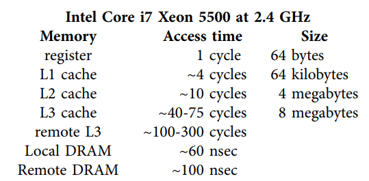
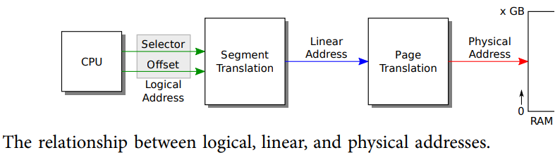
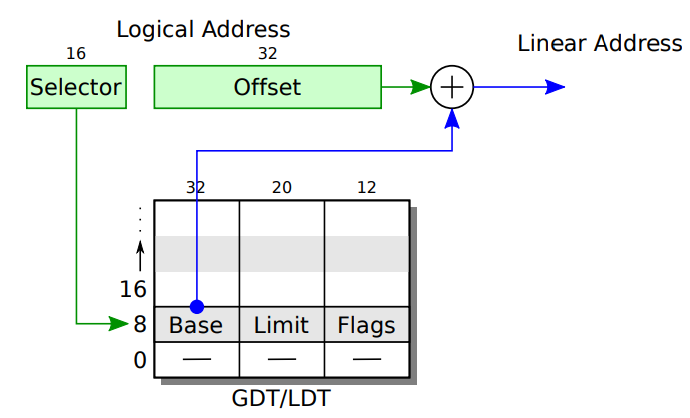

# PC hardware

From our point of view, we can abstract the PC into three components: CPU,
memory, and input/output (I/O) devices. The CPU performs computation, the memory contains instructions and data for that computation, and devices allow the CPU to interact with hardware for storage, communication, and other functions.

You can think of main memory as connected to the CPU with a set of wires, or lines, some for address bits, some for data bits, and some for control flags. To read a value from main memory, the CPU sends high or low voltages representing 1 or 0 bits on the address lines and a 1 on the ‘‘read’’ line for a prescribed amount of time and then reads back the value by interpreting the voltages on the data lines. To write a value to main memory, the CPU sends appropriate bits on the address and data lines
and a 1 on the ‘‘write’’ line for a prescribed amount of time. Real memory interfaces are more complex than this, but the details are only important if you need to achieve high performance.

## Processor and memory

A computer’s CPU (central processing unit, or processor) runs a conceptually simple loop: it consults an address in a register called the program counter, reads a machine instruction from that address in memory, advances the program counter past the instruction, and executes the instruction. Repeat. If the execution of the instruction does not modify the program counter, this loop will interpret the memory pointed at by the program counter as **a sequence of machine instructions** to run one after the other. Instructions that **do change the program counter** include branches and function calls.

The execution engine is useless without the ability to store and modify program data. The fastest storage for data is provided by the processor’s register set. **A register is a storage cell inside the processor itself**, capable of holding a machine word-sized value (typically 16, 32, or 64 bits).

The modern x86 provides eight general purpose 32-bit registers—%eax, %ebx, %ecx, %edx, %edi, %esi, %ebp, and %esp—and a program counter %eip (the instruction pointer). The common e prefix stands for extended, as these are 32-bit extensions of the 16-bit registers %ax, %bx, %cx, %dx, %di, %si, %bp, %sp, and %ip. **The two register sets are aliased so that, for example, %ax is the bottom half of %eax: writing to %ax changes the value stored in %eax and vice versa**. The first four registers also have
names for the bottom two 8-bit bytes: %al and %ah denote the low and high 8 bits of %ax; %bl, %bh, %cl, %ch, %dl, and %dh continue the pattern. In addition to these registers, the x86 has **eight 80-bit floating-point registers** as well as a handful of **special-purpose registers like the control registers** %cr0, %cr2, %cr3, and %cr4; **the debug registers** %dr0, %dr1, %dr2, and %dr3; **the segment registers** %cs, %ds, %es, %fs,
%gs, and %ss; and **the global and local descriptor table pseudo-registers** %gdtr and %ldtr. **The control registers and segment registers are important to any operating system**. The floating-point and debug registers are less interesting and not used by xv6.

**Registers are fast but expensive**. Most processors provide at most a few tens of general-purpose registers. The next conceptual level of storage is the main random-access memory (RAM). **Main memory is 10-100x slower than a register, but it is much cheaper**, so there can be more of it. **One reason main memory is relatively slow** is that it is physically separate from the processor chip. An x86 processor has a few dozen registers, but a typical PC today has gigabytes of main memory. Because of the enormous differences in both access speed and size between registers and main memory, most processors, including the x86, **store copies of recently-accessed sections of main memory in on-chip cache memory. The cache memory serves as a middle ground between registers and memory both in access time and in size. Today’s x86 processors typically have three levels of cache. Each core has a small first-level cache with access times relatively close to the processor’s clock rate and a larger second-level cache. Several cores share an L3 cache**. The following figure shows the levels in the memory hierarchy and their access times for an Intel i7 Xeon processor.

**For the most part, x86 processors hide the cache from the operating system**, so we can think of the processor as having just two kinds of storage—registers and memory—and not worry about the distinctions between the different levels of the memory hierarchy.

## I/O

Processors must communicate with devices as well as memory. The x86 processor provides special `in` and `out` instructions that **read and write** values from device addresses called I/O ports. The hardware implementation of these instructions is essentially the same as reading and writing memory. **Early x86 processors had an extra address line: 0 meant read/write from an I/O port and 1 meant read/write from main memory**. Each hardware device monitors these lines for reads and writes to its assigned range of I/O ports. A device’s ports let the software configure the device, examine its status, and cause the device to take actions; for example, software can use I/O port reads and writes to cause the disk interface hardware to read and write sectors on the disk.

Many computer architectures have no separate device access instructions. **Instead the devices have fixed memory addresses and the processor communicates with the device (at the operating system’s behest) by reading and writing values at those addresses.** In fact, modern x86 architectures use this technique, called **memory-mapped I/O**, for most high-speed devices such as network, disk, and graphics controllers. For reasons of backwards compatibility, though, the old in and out instructions linger, as
do legacy hardware devices that use them, such as the IDE disk controller, which xv6 uses.

# The boot loader

**When an x86 PC boots, it starts executing a program called the BIOS** (Basic Input/Output System), which is stored in non-volatile memory on the motherboard. The BIOS’s job is to prepare the hardware and then transfer control to the operating system. **Specifically, it transfers control to code loaded from the boot sector, the first 512-byte sector of the boot disk**. The boot sector contains the **boot loader: instructions that load the kernel into memory**. The BIOS loads the boot sector at memory address 0x7c00 and then jumps (sets the processor’s %ip) to that address. **When the boot loader begins executing, the processor is simulating an Intel 8088, and the loader’s job is to put the processor in a more modern operating mode, to load the xv6 kernel from disk into memory, and then to transfer control to the kernel**. The xv6 boot loader comprises two source files, one written in a combination of 16-bit and 32-bit x86 assembly (`bootasm.S`) and one written in C (`bootmain.c`).

## Code: Assembly bootstrap

The first instruction in the boot loader is `cli`, which disables processor interrupts. **Interrupts are a way for hardware devices to invoke operating system functions called interrupt handlers**. The BIOS is a tiny operating system, and it might have set up its own interrupt handlers as part of the initializing the hardware. **But the BIOS isn’t running anymore—the boot loader is—so it is no longer appropriate or safe to handle interrupts from hardware devices**. When xv6 is ready (in Chapter 3), it will re-enable interrupts.

**The processor is in real mode, in which it simulates an Intel 8088**. In real mode there are eight 16-bit general-purpose registers, but the processor sends 20 bits of address to memory. The segment registers %cs, %ds, %es, and %ss provide the additional bits necessary to generate 20-bit memory addresses from 16-bit registers. When a program refers to a memory address, the processor automatically adds 16 times the value of one of the segment registers; these registers are 16 bits wide. Which segment register is usually implicit in the kind of memory reference: **instruction fetches use %cs, data reads and writes use %ds, and stack reads and writes use %ss**.

Xv6 pretends that an x86 instruction uses a virtual address for its memory operands, **but an x86 instruction actually uses a logical address** (see following figure). A logical address consists of a segment selector and an offset, and is sometimes written as `segment:offset`. More often, the segment is implicit and the program only directly manipulates the offset. **The segmentation hardware performs the translation described above to generate a linear address. If the paging hardware is enabled, it translates linear addresses to physical addresses; otherwise the processor uses linear addresses as physical addresses.**

**The boot loader does not enable the paging hardware**; the logical addresses that it uses are translated to linear addresses by the segmentation hardware, and then used directly as physical addresses. **Xv6 configures the segmentation hardware to translate logical to linear addresses without change, so that they are always equal. For historical reasons we have used the term virtual address to refer to addresses manipulated by programs; an xv6 virtual address is the same as an x86 logical address, and is equal to the linear address to which the segmentation hardware maps it**. Once paging is enabled, the only interesting address mapping in the system will be linear to physical.

Real mode’s 16-bit general-purpose and segment registers make it awkward for a program to use more than 65,536 bytes of memory, and impossible to use more than a megabyte. **X86 processors since the 80286 have a protected mode, which allows physical addresses to have many more bits**, and (since the 80386) a ‘‘32-bit’’ mode that causes registers, virtual addresses, and most integer arithmetic to be carried out with 32 bits rather than 16. The xv6 boot sequence enables protected mode and 32-bit mode as follows.

In protected mode, a **segment register is an index into a segment descriptor table** (see following figure). Each table entry specifies **a base physical address, a maximum virtual address called the limit, and permission bits for the segment**. These permissions are the protection in protected mode: the kernel can use them to ensure that a program uses only its own memory.

xv6 makes almost no use of segments; it uses the paging hardware instead, as Chapter 2 describes. **The boot loader sets up the segment descriptor table gdt** so that all segments have a base address of zero and the maximum possible limit (four gigabytes). The table has a null entry, one entry for executable code, and one entry to data. **The code segment descriptor has a flag set that indicates that the code should run in 32-bit mode. With this setup, when the boot loader enters protected mode, logical addresses map one-to-one to physical addresses**.

The boot loader executes an lgdt instruction (9141) to load the processor’s global descriptor table (GDT) register with the value gdtdesc (9187-9189), which points to the table gdt.

Once it has loaded the GDT register, the boot loader **enables protected mode by setting the 1 bit** (CR0_PE) in register %cr0 (9142-9144). **Enabling protected mode does not immediately change how the processor translates logical to physical addresses**; it is only when one loads a new value into a segment register that the processor reads the GDT and changes its internal segmentation settings. One cannot directly modify %cs, so instead the code executes an ljmp (far jump) instruction (9153), which **allows a code segment selector to be specified**. The jump continues execution at the next line (9156) but in doing so sets %cs to refer to the code descriptor entry in gdt. That descriptor describes a 32-bit code segment, so the processor switches into 32-bit mode. The boot loader has nursed the processor through an evolution from 8088 through 80286 to 80386.

**The boot loader’s first action in 32-bit mode is to initialize the data segment registers with SEG_KDATA (9158-9161). Logical address now map directly to physical addresses**. The only step left before executing C code is to set up a stack in an unused region of memory. The memory from 0xa0000 to 0x100000 is typically littered with device memory regions, and the xv6 kernel expects to be placed at 0x100000. The boot loader itself is at 0x7c00 through 0x7e00 (512 bytes). **Essentially any other section of memory would be a fine location for the stack. The boot loader chooses 0x7c00 (known in this file as $start) as the top of the stack; the stack will grow down from there**, toward 0x0000, away from the boot loader.

**Finally the boot loader calls the C function bootmain (9168). Bootmain’s job is to load and run the kernel. It only returns if something has gone wrong**. In that case, the code sends a few output words on port 0x8a00 (9170-9176). On real hardware, there is no device connected to that port, so this code does nothing. If the boot loader is running inside a PC simulator, port 0x8a00 is connected to the simulator itself and can transfer control back to the simulator. Simulator or not, the code then executes an infinite loop (9177-9178). A real boot loader might attempt to print an error message first.

## Code: C bootstrap

The C part of the boot loader, bootmain.c (9200), expects to find a copy of the kernel executable on the disk starting at the second sector. The kernel is an ELF format binary, as we have seen in Chapter 2. **To get access to the ELF headers**, bootmain loads the first 4096 bytes of the ELF binary (9214). It places the in memory copy at address 0x10000.

**The next step is a quick check that this probably is an ELF binary, and not an uninitialized disk**. Bootmain reads the section’s content starting from the disk location off bytes after the start of the ELF header, and writes to memory starting at address `paddr`. Bootmain calls `readseg` to load data from disk (9238) and calls `stosb` to zero the remainder of the segment (9240). `Stosb` (0492) uses the x86 instruction `rep stosb` to initialize every byte of a block of memory.

**The kernel has been compiled and linked so that it expects to find itself at virtual addresses starting at 0x80100000**. Thus, function call instructions must mention destination addresses that look like `0x801xxxxx`; you can see examples in `kernel.asm`. This address is configured in `kernel.ld`. 0x80100000 is a relatively high address, towards the end of the 32-bit address space; Chapter 2 explains the reasons for this choice. There may not be any physical memory at such a high address. **Once the kernel starts executing, it will set up the paging hardware to map virtual addresses starting at 0x80100000 to physical addresses starting at 0x00100000**; the kernel assumes that there is physical memory at this lower address. At this point in the boot process, however, paging is not enabled. Instead, kernel.ld specifies that the ELF `paddr` start at 0x00100000, **which causes the boot loader to copy the kernel to the low physical addresses to which the paging hardware will eventually point**.

**The boot loader’s final step is to call the kernel’s entry point**, which is the instruction at which the kernel expects to start executing. For xv6 the entry address is 0x10000c:  you can typing `objdump -f kernel` to find out the entry point.

By convention, the `_start` symbol specifies the ELF entry point, which is defined in the file `entry.S` (1040). **Since xv6 hasn’t set up virtual memory yet, xv6’s entry point is the physical address of entry** (1044).

## Real world

The boot loader described in this appendix compiles to around 470 bytes of machine code, depending on the optimizations used when compiling the C code. In order to fit in that small amount of space, **the xv6 boot loader makes a major simplifying assumption, that the kernel has been written to the boot disk contiguously starting at sector 1**. More commonly, kernels are stored in ordinary file systems, where they may not be contiguous, or are loaded over a network. These complications require the boot loader to be able to drive a variety of disk and network controllers and understand various file systems and network protocols. **In other words, the boot loader itself must be a small operating system. Since such complicated boot loaders certainly won’t fit in 512 bytes, most PC operating systems use a two-step boot process**. First, a simple boot loader like the one in this appendix loads a full-featured boot-loader from a known disk location, often relying on the less space-constrained BIOS for disk access rather than trying to drive the disk itself. Then the full loader, relieved of the 512-byte limit, can implement the complexity needed to locate, load, and execute the desired kernel. **Modern PCs avoid many of the above complexities, because they support the Unified Extensible Firmware Interface (UEFI), which allows the PC to read a larger boot loader from the disk (and start it in protected and 32-bit mode).**