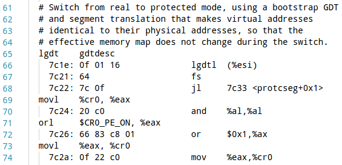

# Lab 1 的练习答案和重点知识梳理

[Lab 1: Booting a PC](https://pdos.csail.mit.edu/6.828/2017/labs/lab1/)

## 工具的安装和启动 Qemu 和 JOS

参照 [Tools Used in 6.828](https://pdos.csail.mit.edu/6.828/2017/tools.html) 安装一系列的工具。下图是我成功安装以后，启动 Qemu 的截图。

1. Everything after '**Booting from Hard Disk**...' was printed by our skeletal JOS kernel.

2. To quit qemu, type `Ctrl+a x`

## The PC's Physical Address Space

下图为 PC 的物理地址空间布局：

## The ROM BIOS

输入 `make qemu-nox-gdb`，启动 QEMU 作为 remote debugging target; 用 GDB 开始调试，输入 `make gdb`，得到下图所示内容：

当 CPU 加电以后，它会从 ROM 中读取 Bios 启动固件，进入实模式并且设置 CS 寄存器到 0xf000，IP 到 0xfff0，然后开始执行指令。从上图中画线部分可以得出：

- The IBM PC starts executing at physical address 0x000ffff0, which is at the very top of the 64KB area reserved for the ROM BIOS
- The PC starts executing with CS = 0xf000 and IP = 0xfff0
- The first instruction to be executed is a jmp instruction, which jumps to the segmented address CS = 0xf000 and IP = 0xe05b

Why does QEMU start like this? This is how Intel designed the 8088 processor, which IBM used in their original PC. Because the BIOS in a PC is "hard-wired" to the physical address range 0x000f0000-0x000fffff, this design **ensures that the BIOS always gets control of the machine first** after power-up or any system restart - which is crucial because on power-up there is no other software anywhere in the machine's RAM that the processor could execute.

实模式寻址公式：**physical address = 16 * segment + offset**

通过 GDB 的 si (Step Instruction) 命令来单步调试 BIOS，你会发现 BIOS 做了一些基本的设置，比如：它会设置 interrupt descriptor table，初始化各种设备（如：VGA display）。After initializing the PCI bus and all the important devices the BIOS knows about, it searches for a bootable device such as a floppy, hard drive, or CD-ROM. Eventually, **when it finds a bootable disk, the BIOS reads the boot loader from the disk and transfers control to it**.

## The Boot Loader

Floppy and hard disks for PCs are divided into 512 byte regions called **sectors**. A sector is the disk's **minimum transfer granularity**: each read or write operation must be one or more sectors in size and aligned on a sector boundary. If the disk is bootable, **the first sector is called the boot sector**, since this is where the boot loader code resides. When the BIOS finds a bootable floppy or hard disk, **it loads the 512-byte boot sector into memory at physical addresses 0x7c00 through 0x7dff**, and then uses a jmp instruction to set the CS:IP to 0000:7c00, passing control to the boot loader.

The boot loader from JOS that consists of one assembly language source file, `boot/boot.S`, and one C source file, `boot/main.c`, and it perform two main functions:

1. First, the boot loader switches the processor from real mode to 32-bit protected mode, because it is only in this mode that software can access all the memory above 1MB in the processor's physical address space. Offsets only have 16 bits in real mode whereas it has 32 bits in protected mode, so it can access more memory address in protected mode.
2. Second, the boot loader reads the kernel from the hard disk.

I would mention two important files(`boot.asm` for the boot loader and `kernel.asm` for the JOS kernel) that **makes debugging easier**. Each of  the files is a disassembly and they make us easier to see exactly where in physical memory all of the code resides, and makes it easier to track what's happening while stepping through the boot-loader/JOS-kernel in GDB.

By tracking `boot.asm`, I can answer the following questions:

- At what point does the processor start executing 32-bit code? What exactly causes the switch from 16- to 32-bit mode?

> The answer for the question in the picture below:

- What is the last instruction of the boot loader executed, and what is the first instruction of the kernel it just loaded?

> 7d61:	ff 15 18 00 01 00    call   *0x10018
> movw   $0x1234,0x472

- Where is the first instruction of the kernel?

> The command `objdump -f obj/kern/kernel` can find out start address of the kernel. The other method is dumping word at `0x10018` with x/x command of GDB. Why the address is `0x10018`? Since the last instruction of the boot loader executed is `call *0x10018`, the first instruction of the kernel should be at this address.

- How does the boot loader decide how many sectors it must read in order to fetch the entire kernel from disk? Where does it find this information?

> According to ELF header. The [Wikipedia page](https://en.wikipedia.org/wiki/Executable_and_Linkable_Format) has a short description for **Executable and Linkable Format**

# Loading the Kernel
