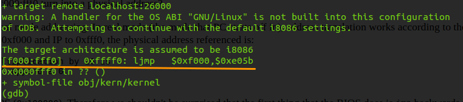

# Lab 1 的练习答案和重点知识梳理

[Lab 1: Booting a PC](https://pdos.csail.mit.edu/6.828/2017/labs/lab1/)

## 工具的安装和启动 Qemu 和 JOS

参照 [Tools Used in 6.828](https://pdos.csail.mit.edu/6.828/2017/tools.html) 安装一系列的工具。下图是我成功安装以后，启动 Qemu 的截图。

1. Everything after '**Booting from Hard Disk**...' was printed by our skeletal JOS kernel.

2. To quit qemu, type `Ctrl+a x`

## The PC's Physical Address Space

下图为 PC 的物理地址空间布局：

## The ROM BIOS

输入 `make qemu-nox-gdb`，启动 QEMU 作为 remote debugging target; 用 GDB 开始调试，输入 `make gdb`，得到下图所示内容：

当 CPU 加电以后，它会从 ROM 中读取 Bios 启动固件，进入实模式并且设置 CS 寄存器到 0xf000，IP 到 0xfff0，然后开始执行指令。从上图中画线部分可以得出：

- The IBM PC starts executing at physical address 0x000ffff0, which is at the very top of the 64KB area reserved for the ROM BIOS
- The PC starts executing with CS = 0xf000 and IP = 0xfff0
- The first instruction to be executed is a jmp instruction, which jumps to the segmented address CS = 0xf000 and IP = 0xe05b

Why does QEMU start like this? This is how Intel designed the 8088 processor, which IBM used in their original PC. Because the BIOS in a PC is "hard-wired" to the physical address range 0x000f0000-0x000fffff, this design **ensures that the BIOS always gets control of the machine first** after power-up or any system restart - which is crucial because on power-up there is no other software anywhere in the machine's RAM that the processor could execute.

实模式寻址公式：**physical address = 16 * segment + offset**

通过 GDB 的 si (Step Instruction) 命令来单步调试 BIOS，你会发现 BIOS 做了一些基本的设置，比如：它会设置 interrupt descriptor table，初始化各种设备（如：VGA display）。After initializing the PCI bus and all the important devices the BIOS knows about, it searches for a bootable device such as a floppy, hard drive, or CD-ROM. Eventually, **when it finds a bootable disk, the BIOS reads the boot loader from the disk and transfers control to it**.

## The Boot Loader